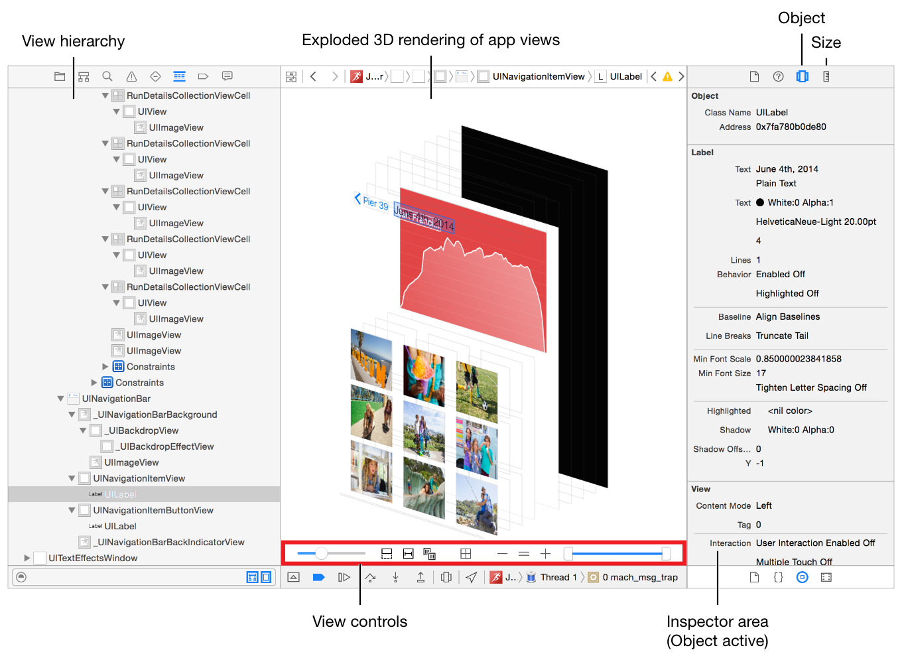

[]()
[]()
[](https://travis-ci.org/stanwood/Macchiato_iOS)

Mastering UITesting takes time. While making sure to catche all edge cases, system alerts, and any uncommon UI solution developed under the hood, `Macchiato` allows you to simplify the process. Removing the burdon of covering edge cases, animations, networking, and system alerts, simply manage your test cases in a `JSON` file locally or remotly. 

This is a perfect solution for developers that wnat to integrate their UITesting with their own CI solution.

## Table of contents

- [Installation](#installation)
- [Usage](#usage)
- [Creating Your Test Cases](#creating-your-test-cases)
- [Handling System Alerts](#handling-system-alerts)
- [Taking Screenshots](#screenshots)
- [Licence](#licence)

## Installation

```ruby
target 'Project_Tests' do
      inherit! :search_paths
      pod 'Macchiato'
end
```

## Usage

### Step One - Set up the testing tool

1. Add a new `XCTestCase` to the UI Test target and import `Macchiato`

	```swift
	import XCTest
	import Macchiato

	class MacchiatoTests: XCTestCase {

        override func setUpWithError() throws {
            
        }

        override func tearDownWithError() throws {
            
        }
     }
	```

2. Let's configure and launch the sdk

	Add this to the `setUpWithError()` function

	```swift
	let app = XCUIApplication()
	var testingManager: Macchiato.Manager!
    
	override func setUpWithError() throws {

        	continueAfterFailure = false

        	guard let path = Bundle(for: type(of: self)).url(forResource: "tests", withExtension: "json") else { XCTFail("No tests file found"); return }
            
         let configurations = Macchiato.Configurations(contentsOfFile: path, bundleIdentifier: "com.company.ios", app: app)
         testingManager = Macchiato.Manager(configurations: configurations, target: self)
         testingManager.launch()
   	 }
	```
    
    You can also inject `contentsOfURL`. 
    
```swift
  let configurations = Macchiato.Configurations(contentsOfURL: url, bundleIdentifier: "com.company.ios", app: app)
```

3. Now we are ready to set up the test case

	```swift
	func testMacchiato(){
		testingManager.runTests()
	}
	```

	`testingManager.runTests()` will run the tests and report if there are any failures.


#### Step Two - Configure your project

##### Overview

The test navigation works by querying `XCUIElement` & `XCUIElementQuery` types. Check out the navigation types for a full list [here](https://github.com/stanwood/Macchiato_iOS/blob/master/Macchiato/Classes/NavigationType.swift). The UI Testing tool identifies each element by either an index, or a key, for example:

```swift
// Index
buttons.element(boundBy: index)

// Key
buttons[key]
```

##### What we need to do?

We need to set an `accessibilityIdentifier` for each element. This can be done in Xcode, in the utilities panel under the identity inspector.

You are starting to feel this may take too long! Say no more... This is handled for you, all you have to do is follow 3 simple steps:

	1) Add `pod 'StanwoodCore` to your podfile
	2) import StanwoodCore in any .swift files that contains UI elements
	3) When setting labels/text, you have two options:
		a) Set the localised KEY in interface builder, i'e "MY_KEY_TITLE"
		b) Set `.localisedText` instead of `.text`.
		Note> It is required that you do not localise the key, rather then pass in the key. This will get handled by StanwoodCore

[StanwoodCore Full Doc](https://stanwood.github.io/Stanwood_Core)

### Creating Your Test Cases

#### Overview

Macchiato works by querying element types from the views hierarchy and they can be accessed by calling a custom key or an index. For example, if we look at the image below from develop.apple.com, we can see how the elements are laid out.



This is a great example where we have a top `UIView`, which can be identified with a key, and a `UICellectionView`, which cells can be identified with an index.

#### Let's create our first test case

1. First, we want to set the schema JSON format

	```json
	{
		"test_cases" : [

		]
	}
	```

2. Creating a test case

	```json
	{
		"test_cases": [
			"id" : "1",
			"title": "Images Test",
			"description": "Testing if the fifth image is tappable"
		]
	}
	```

3. Setting `navigation` action to support the test case

	The navigation is a collection of navigation actions. We need to set navigation items to navigation to what we want to test. For example, let's set navigation items according to the example above.

	Let's assume this view is on:

	- The second tab can be access with `tabs` as index 1
	- And the images view is accessed by tapping a button in the tab's `rootView` with an identifier of `pierIdentifier`
	- The fifth image can be access with `cells` at index 4

		```json
		{
			"test_cases": [
				"id" : "1",
				"title": "Images Test",
				"description": "Testing if the fifth image is tappable",
				"navigation" : [
					"tabs[1].action.tap",
					"buttons['pierIdentifier'].action.tap",
					"cells[4].action.tap"
				]
			]
		}
		```

4. Now, let's say we want to test the image at position 11, which cannot be accessed in the view, we can set different actions, like `swipeUp, swipeDown`. For example:


	```json
	{
		"test_cases": [
			"id": "1",
			"title": "Images Test",
			"description": "Testing if the fifth image is tappable",
			"navigation": [
				"tabs[1].action.tap",
				"buttons['pierIdentifier'].action.tap",
				"cells[4].action.swipeUp",
				"cells[10].action.tap"
			]
		]
	}
	```

For the full action list, please check [here](https://github.com/stanwood/Macchiato_iOS/blob/master/Macchiato/Classes/Action.swift)

For the full navigation types, please check [here](https://github.com/stanwood/Macchiato_iOS/blob/master/Macchiato/Classes/NavigationType.swift). The UI Testing tool identifies each element by either an index, or a key.

>Note: Element identifiers will be listed in each project documentation  under **UI Testing Identifiers**

#### Handling System Alerts

`Macchiato` supports system alerts. To monitor system alerts, simply add `.monitor` to any navigation handle.

```javascript
	{
		"test_cases": [
			"id": "1",
			"title": "Images Test",
			"description": "Testing if the fifth image is tappable",
			"navigation": [
				"tabs[1].action.tap",
				"buttons['pierIdentifier'].action.tap.monitor",
				"cells[4].action.swipeUp",
				"cells[10].action.tap.monitor"
			]
		]
	}
```

#### Screenshots

Screenshots have been integrated and has been added to the action list. To take a screenshot, add `action.screenshot`.

To enable screenshots, add Environment Variable into the scheme `Name: SRCROOT, Value: ${SRCROOT}`

```javascript
	{
		"test_cases": [
			"id": "1",
			"title": "Images Test",
			"description": "Testing if the fifth image is tappable",
			"navigation": [
				"action.screenshot",
				"tabs[1].action.tap",
				"buttons['pierIdentifier'].action.tap.monitor",
				"cells[4].action.swipeUp",
				"action.screenshot",
				"cells[10].action.tap.monitor"
			]
		]
	}
```

## Release Notes

### `0.5`

- Renaming framework to Macchiato
- Adding support for contents of file or url

### `0.1.5`

- Adding navigationBars support
- Improving error handling
- Removing some unused keys

## Author

Tal Zion tal.zion@stanwood.io

## Licence

Macchiato is under MIT Licence. See the [LICENSE](https://github.com/stanwood/Macchiato_iOS/blob/master/LICENSE) file for more info.
